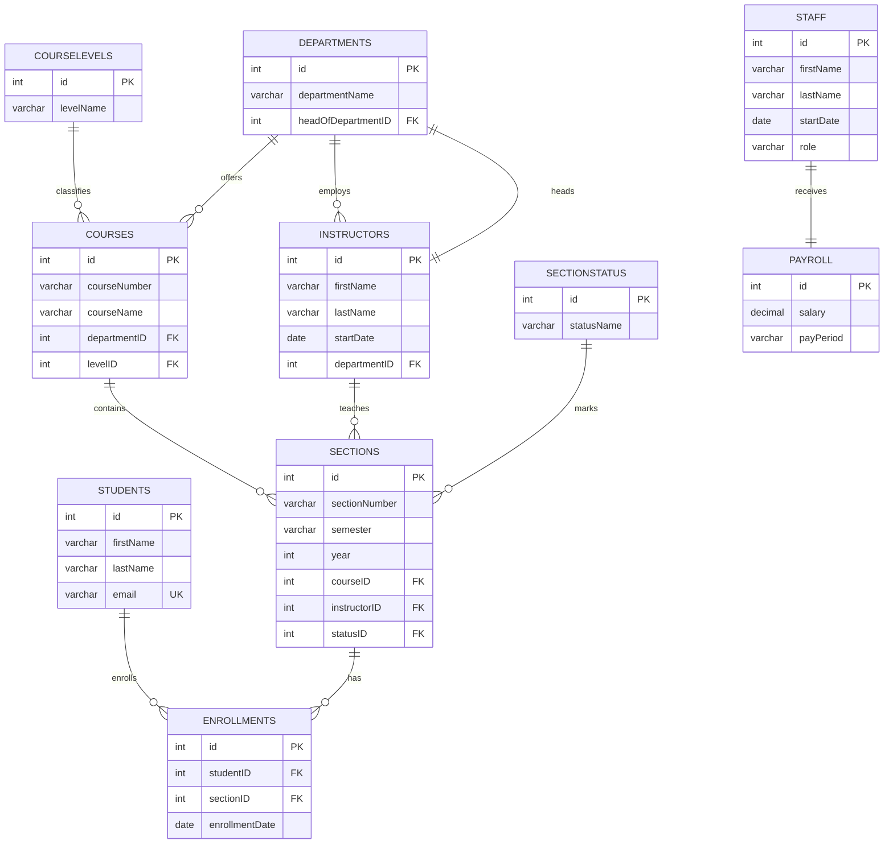
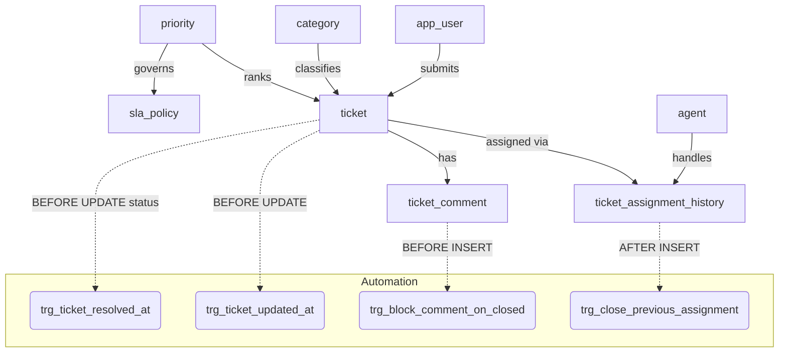

# University Database — SQL Migrations

A fully-relational helpdesk database schema built for **PostgreSQL / Supabase**.  
It tracks users, agents, support tickets, SLA policies, assignment history, and comments.

---

## Run Order

| File | Purpose |
|------|---------|
| [`001_init.sql`](001_init.sql) | Create all tables, constraints, and indexes |
| [`002_seed_data.sql`](002_seed_data.sql) | Insert sample/seed data |
| [`002_triggers.sql`](002_triggers.sql) | Add triggers for automation & business rules |
| [`003_views.sql`](003_views.sql) | Create reporting and dashboard views |
| [`004_queries_example.sql`](004_queries_example.sql) | Example SELECT / UPDATE / DELETE queries |

> Additional deep-dives are in [`docs/`](docs/).

---

## Entity-Relationship Diagram



---

## Triggers (`002_triggers.sql`)

| Trigger | Table | Event | What it does |
|---------|-------|-------|--------------|
| `trg_ticket_updated_at` | `ticket` | `BEFORE UPDATE` | Stamps `updated_at = NOW()` automatically |
| `trg_ticket_resolved_at` | `ticket` | `BEFORE UPDATE` (status change) | Sets `resolved_at` when status → Resolved/Closed; clears it on revert |
| `trg_close_previous_assignment` | `ticket_assignment_history` | `AFTER INSERT` | Closes any existing open assignment so only one agent is active per ticket |
| `trg_block_comment_on_closed` | `ticket_comment` | `BEFORE INSERT` | Raises an exception if the target ticket is `'Closed'` |

---

## Views (`003_views.sql`)

| View | Description |
|------|-------------|
| `vw_open_tickets_dashboard` | All open/in-progress tickets with joined user, agent, category, priority, and age in hours |
| `vw_agent_workload` | Active agents ranked by number of currently assigned tickets |
| `vw_sla_risk` | Open tickets colour-coded as **OK / At Risk / Breached** against their SLA response target |
| `vw_ticket_full_history` | Unified chronological event stream (assignments + unassignments + comments) per ticket |
| `vw_category_summary` | Per-category totals and average resolution time for executive reporting |

---

## Schema Overview (flow)



---

## Quick Start

```sql
-- Run in order inside psql or the Supabase SQL editor
\i 001_init.sql
\i 002_seed_data.sql
\i 002_triggers.sql
\i 003_views.sql
\i 004_queries_example.sql
```

---

## Docs

Extended documentation lives in [`docs/`](docs/):

| File | Contents |
|------|---------|
| `docs/schema.md` | Detailed column-level notes and constraint explanations |
| `docs/triggers.md` | Trigger logic walk-through with example scenarios |
| `docs/views.md` | View query explanations and sample output |
| `docs/sla.md` | SLA policy design and breach-detection logic |
